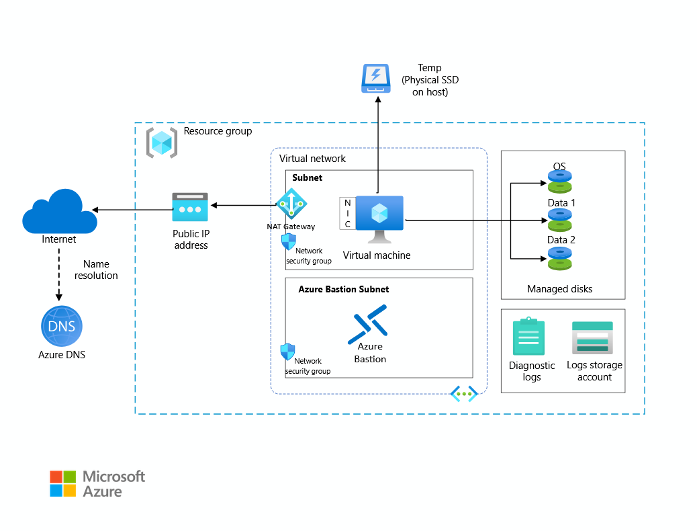
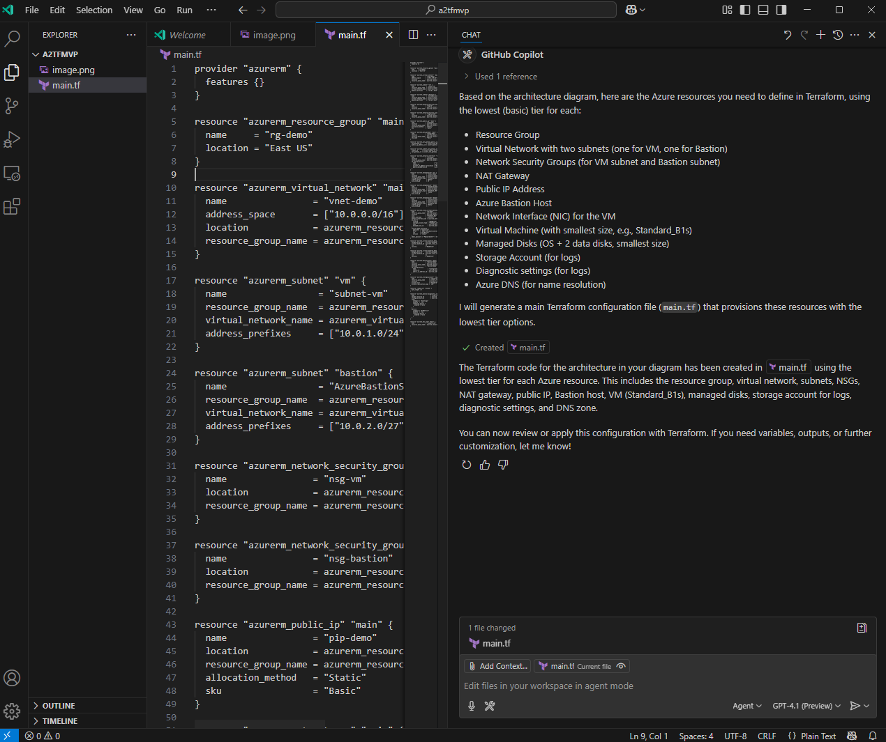

# a2tfmvp

This repository contains a MVP Terraform configuration for the architecture in [Run a Linux VM on Azure](https://learn.microsoft.com/en-us/azure/architecture/reference-architectures/n-tier/linux-vm) from Azure Architecture Center.

The purpose of this repository is to hold ```main.tf``` that was generated using GitHub Copilot with ```image.png``` as a Vision input and the following prompt:

```
Create the Terraform code of the architecture in #file:image.png with the lowest tier of all resources that are in this diagram
```

The objective is to demonstrate the viability of using GitHub Copilot to accelerate translation of visual architecture into Infrastructure-as-Code.

The image used:



Scerenshot:



